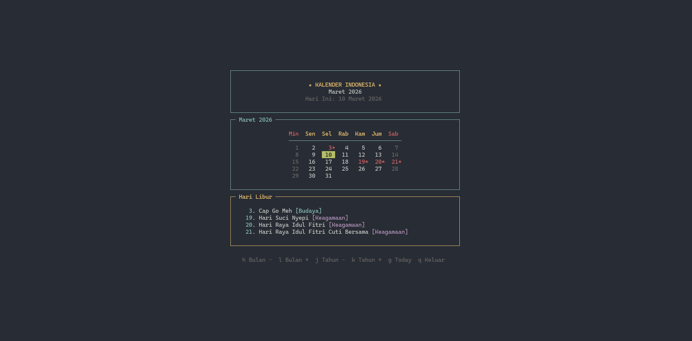

# ID Calendar TUI

[](https://badge.fury.io/rb/id-calendar-tui)
[](https://github.com/adipurnm/indonesia-cal-tui/pkgs/container/indonesia-cal-tui)

A terminal-based calendar application for Indonesian public holidays with vim-like navigation.



## Features

- Full calendar view with Indonesian public holidays
- Vim-like navigation (h/j/k/l)
- Navigate months with arrow keys
- Jump to today with `g`
- Color-coded holidays (National, Religious, Cultural)
- Clean, centered TUI interface

## Installation

### Via RubyGems

```bash
gem install id-calendar-tui
calendar
```

### Via Docker (GHCR)

```bash
docker run --rm -it ghcr.io/adipurnm/indonesia-cal-tui:latest
```

### From Source

```bash
git clone https://github.com/adipurnm/indonesia-cal-tui.git
cd indonesia-cal-tui
bundle install
bundle exec ruby bin/calendar
```

## Usage

```bash
# Run the calendar
calendar

# Or with bundle
bundle exec calendar
```

## Navigation

| Key | Action |
|-----|--------|
| `h`, `←` | Previous month |
| `l`, `→` | Next month |
| `j`, `k` | Previous/Next year |
| `g` | Go to today |
| `q`, `Ctrl+C` | Quit |

## Holidays Included

- **National Holidays**: New Year, Independence Day, etc.
- **Islamic Holidays**: Eid al-Fitr, Eid al-Adha, etc.
- **Hindu Holidays**: Nyepi (Day of Silence)
- **Chinese New Year**: Imlek, Cap Go Meh
- **Christian Holidays**: Good Friday, Easter, Christmas

## Requirements

- Ruby 2.6+
- Terminal with color support

## Development

```bash
# Install dependencies
bundle install

# Run the application
bundle exec ruby bin/calendar

# Build gem
bundle exec gem build id-calendar-tui.gemspec

# Build Docker image
docker build -t id-calendar-tui .
```

## Releasing

To release a new version:

```bash
# Update version in id-calendar-tui.gemspec
git add .
git commit -m "Bump version to x.x.x"
git tag vx.x.x
git push origin vx.x.x
```

This will automatically:
- Publish to [RubyGems](https://rubygems.org/gems/id-calendar-tui)
- Publish Docker image to [GHCR](https://github.com/adipurnm/indonesia-cal-tui/pkgs/container/indonesia-cal-tui)

## Contributing

Bug reports and pull requests are welcome.

## License

MIT License - see [LICENSE](LICENSE) file for details.